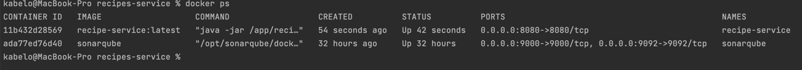

# Recipes Service

This is a recipe service used to manage users' favourite meals and step by step process in creating the magic in the kitchen.

## Tools/Libraries Used
- [docker-compose](https://docs.docker.com/compose/install/)
- [Java 17](https://www.oracle.com/java/technologies/javase/jdk17-archive-downloads.html)
- [Maven](https://maven.apache.org/install.html)
- [Spring Boot](https://spring.io/)
- [MapStruct](https://mapstruct.org/)
- [Lombok](https://projectlombok.org/)
- [H2](https://www.h2database.com/html/main.html)
- [SpringDoc OpenAPI](https://springdoc.org/v2/)

## Requirements
For building and running the app locally, ensure the above tools/libraries have been installed and configured

To build the application, navigate to the root folder and run the below 

`./mvnw clean install`

## How to run the application
To run the application, the root folder contains a `docker-compose.yaml` where the bank-x and rabbitmq services have been defined.
Make sure that docker is installed on your machine and is up and running.

Open a terminal and run the below command to start the services => this will create and start the service containers (the '-d' ensure they're ran in the background)

`docker-compose -f docker-compose.yaml up -d`

Execute `docker ps` from the terminal to check if the containers are up and running, below is an example result of running docker ps:

We can check a specific container's logs by running: `docker logs <CONTAINER_ID> -f`

## Accessing API documentation
Once the application is up and running, the API documentation can be accessed from the links below:

* [Swagger UI](http://localhost:8080/swagger-ui/index.html)
* [OpenAPI Yaml file](http://localhost:8080/v3/api-docs.yaml)

## Stopping the service

To stop the service, run `docker-compose -f docker-compose.yaml down`

## Developer
* Kabelo Mashishi ([Kabelo.Mashishi@icloud.com](Kabelo.Mashishi@icloud.com))